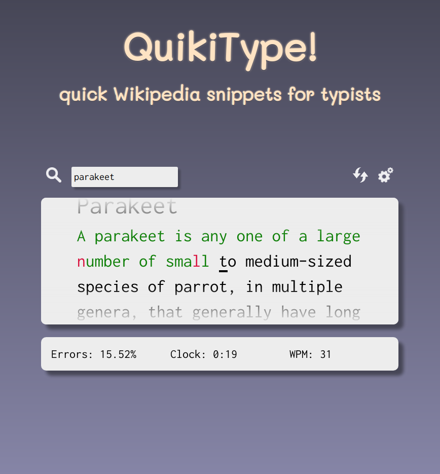

# QuikiType!
  

A single page application created with the [React.js](https://github.com/facebook/react) library and the [Create-React-App](https://github.com/facebook/create-react-app) package.  

Try [Quikitype!](https://quikitype.herokuapp.com/)  

#### A problem to solve
QuikiType attempts to solve a problem I encountered while trying to learn [touch typing](https://en.wikipedia.org/wiki/Touch_typing): the main websites that provide an interface to practice it either present dull, repetitive exercises or have a very limited selection of texts to type. QuikiType aims to offer a better alternative by dynamically fetching some introductory sentences of random Wikipedia articles on arguments selected by the user.  

#### Features
- A search bar to find your favorite arguments on Wikipedia (EN);  
- A responsive, auto-scrolling interface that keeps track of your performance;  
- A timer that automatically stops when out of focus;  
- Up to 20 related articles per fetch and an option to skip through them;  
- Settings to change letter case and special characters sensitivity;  
- A Wikipedia link to the current article, in case you need a break and you're curious about what you're practicing on.  

#### Notes on implementation
The app collects its data from Wikipedia thanks to two Mediawiki API calls: the first one to fetch some page ids associated with the search term, the second one to retrieve the first 3 sentences of the main search result and 19 other randomly selected articles. The initial idea was to select the pages based on the category they belong to, but due to the broadly distributed architecture of Wikipedia categories I had to favor a simpler approach based on search term frequency.  
Several mechanisms were implemented to provide a meaningful article selection: short articles are always filtered out, along with utility pages such as redirects and disambiguation pages. Special characters in non-latin alphabets and diacritics are still shown, but can be easily skipped by pressing spacebar after selecting a dedicated option in the settings.  

#### Installation
Make sure you have Node.js, npm, and React.js packages installed, for the other dependencies see the `Package.json` file. Clone this repo, enter your local folder, then use the command `npm start` to lauch the app.  

